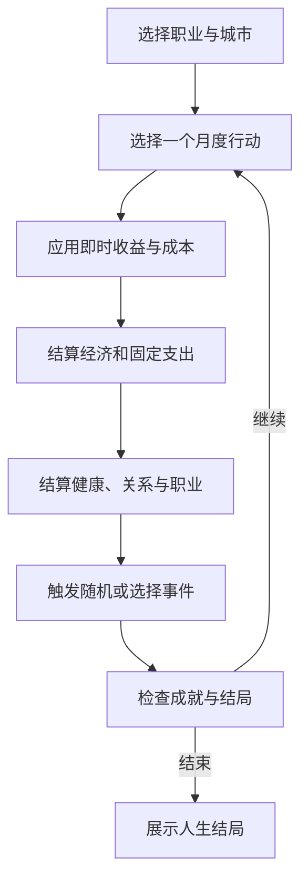
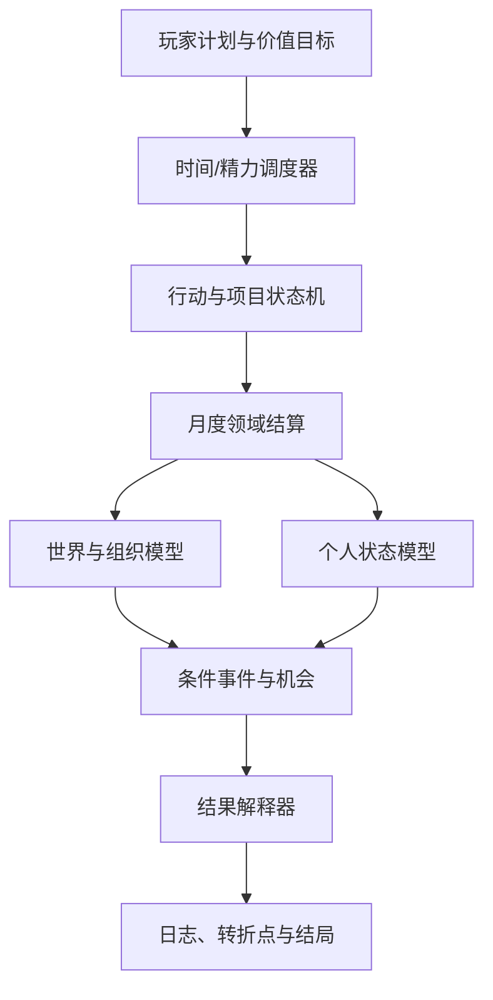

# 程序员人生模拟器 V6 游戏规则、世界观与价值观审计报告

> 审计对象：`DOIT-Ben/coders-life`
>
> 审计分支：`feature/realworld-data-import`
>
> 审计日期：2026-06-28
>
> 审计重点：核心玩法、数值因果、现实数据、职业世界、世界观、价值观、可测试性与演进路线

---

## 1. 执行摘要

V6 已经不再是旧版“程序员梗 + 随机弹窗”的单页小游戏，而是在尝试构建一套以 22～45 岁程序员职业生涯为主轴，综合模拟技术成长、AI 迁移、就业、现金流、健康、关系和人生选择的长期决策游戏。

这次重构的方向正确：React + TypeScript 工程化、纯游戏引擎、月度结算、现实压力状态、事件选择、批量模拟和数据导入，为后续扩展提供了基础。

但当前版本仍存在三个根本问题：

1. **数值指标已经“像现实”，因果链仍然偏游戏化。** 健康债、关系债、可雇佣性等概念齐全，但大量行动仍然是一次点击立即永久增减数值。
2. **若干底层公式存在逻辑错误。** 金额字段可能被限制到 100、投资收益可能双重计入资产、长期失业结局可能无法触发、无家庭状态却自动累积育儿压力。
3. **游戏口头上反对内卷，规则仍然奖励更精致的内卷。** AI、35 岁、休息、关系和心理健康的叙事存在单一化、恐惧化和污名化倾向。

因此，当前最优先的工作不是继续扩充事件数量，而是先修复底层不变量，重构“时间投入 -> 状态变化 -> 阶段成果 -> 外部反馈 -> 长期资本”的因果链。

### 1.1 综合评价

| 维度 | 当前评价 | 核心判断 |
|---|---:|---|
| 产品定位 | 7/10 | 目标明确，已具备独立产品雏形 |
| 核心循环 | 5/10 | 可以运行，但“一月一行动”失真严重 |
| 数值可信度 | 4/10 | 概念丰富，公式和单位仍有硬错误 |
| 职业真实性 | 5/10 | 有市场与岗位风险，但职业生态过窄 |
| 数据可信度 | 3/10 | 研究、媒体和论坛故事被混合量化 |
| 世界观一致性 | 5/10 | 主题集中，但 AI 与年龄叙事过度宿命化 |
| 价值观健康度 | 4/10 | 试图反内卷，但成功标准仍偏工作中心 |
| 架构可演进性 | 7/10 | 分层方向正确，数据契约仍需加强 |
| 可测试性 | 6/10 | 已有单测和模拟入口，缺少分布式平衡验证 |

---

## 2. 审计范围与方法

本次审计覆盖以下模块：

- `src/core/`：初始状态、行动执行、月度结算、通用公式、现实状态默认值；
- `src/systems/`：经济、现金流、健康债、职业、劳动力市场、关系债、人生阶段压力、事件与结局；
- `src/config/`：职业、行动、事件、商店、成就、结局、现实数据映射；
- `src/data/realworld/`：现实行动、现实事件和失败结局数据；
- `src/App.tsx`：玩家实际看到的状态、行动、提示与叙事；
- `scripts/simulate.ts`：自动策略与长期模拟入口；
- 分支与仓库关系：`master` 和 `feature/realworld-data-import` 的历史关系。

审计采用以下判断标准：

1. 同一概念在数据层、规则层和界面层是否语义一致；
2. 数值单位、边界、累积方式和结算顺序是否正确；
3. 行动是否形成可解释的短期与长期后果；
4. 随机事件是否由玩家状态和世界状态驱动；
5. 不同人生道路是否具有可行性，而不是只有一个最优解；
6. 游戏是否把现实偏见当成自然规律；
7. 外部数据能否追溯，是否足以支撑具体参数；
8. 规则是否可以通过确定性测试和批量模拟验证。

---

## 3. 核心需求与当前功能理解

### 3.1 产品核心需求

游戏的核心命题应当是：

> 在 AI 改变软件行业、经济周期波动、个人资源有限的环境中，玩家如何通过持续选择，建立自己认可的职业与生活。

它不是单纯的“活到 45 岁”，也不应只是“避免破产和燃尽”。真正有价值的体验是：玩家能看见每一次选择的机会成本、长期复利和不可逆后果，同时发现成功不只有一种定义。

### 3.2 当前核心循环



### 3.3 已实现的主要系统

- 四类职业与三档城市；
- 月度行动、冷却和重复收益衰减；
- 技术、AI、声望、精神、健康、燃尽、关系、身份感；
- 工资、税费、城市生活成本、被动收入、投资组合；
- 睡眠债、久坐、营养、慢性压力和健康债；
- 可雇佣性、绩效、晋升准备度、技能新鲜度和裁员风险；
- 岗位数量、招聘严格度、薪资压力和 AI 扰动；
- 家庭支持、朋友支持、人脉、孤独和关系债；
- 人生阶段、住房、赡养、育儿、通勤、比较和时间稀缺压力；
- 事件选择、事件记忆、转折点、成就和多结局；
- 本地存档、确定性随机种子和自动模拟脚本。

### 3.4 值得保留的设计

1. **规则分层已经形成。** `core` 负责流程，`systems` 负责领域结算，`config/data` 负责内容，基本方向正确。
2. **现实压力不再只是可见属性。** 健康债、职业资本、关系债等状态能承载长期后果。
3. **重复行动开始有边际收益递减。** 这比“反复点击最高收益动作”更接近现实。
4. **玩家开始获得风险提示。** 即时收益、隐债、机会、身体信号和决策日志有助于理解系统。
5. **已有自动模拟入口。** 后续可以建立统计平衡测试，而不必只靠人工试玩。

---

## 4. 问题总览与优先级

| ID | 级别 | 问题 | 主要影响 |
|---|---|---|---|
| RULE-001 | P0 | 现实金额字段被统一限制到 0～100 | 收入、成本等数据可能失真 |
| RULE-002 | P0 | 投资收益可能同时增加现金和组合价值 | 净资产被重复计算 |
| RULE-003 | P0 | 长期失业结局使用错误计数器 | 结局可能永远无法触发 |
| RULE-004 | P0 | 无家庭状态仍自动产生伴侣与育儿压力 | 世界状态自相矛盾 |
| RULE-005 | P0 | 数据中的条件文本未转成可执行条件 | 现实行动可能无门槛可用 |
| RULE-006 | P1 | 一个月只能执行一个行动 | 时间尺度和生活结构失真 |
| RULE-007 | P1 | AI 替代指数单调增长并最终封顶 | 世界演化宿命化 |
| RULE-008 | P1 | 年龄摩擦从 30 岁后机械增长 | 把年龄偏见自然化 |
| RULE-009 | P1 | 职业和公司类型缺乏真实差异 | 重玩价值和策略空间不足 |
| RULE-010 | P1 | 行动一次点击就产生永久成果 | 缺少过程、失败和质量差异 |
| RULE-011 | P1 | 事件条件过粗且概率池混杂 | 事件与玩家经历脱节 |
| RULE-012 | P1 | 现实数据来源等级没有进入规则 | 论坛故事和研究被同等量化 |
| RULE-013 | P1 | 多组数值存在语义重复 | 玩家难以理解，开发难以校准 |
| RULE-014 | P2 | 商店多数商品是一次性属性药水 | 缺少耐久、订阅和使用条件 |
| VALUE-001 | P0 | 心理健康问题被直接定义为失败结局 | 价值导向和表达风险 |
| VALUE-002 | P1 | “35 岁危机”成为默认人生定律 | 强化行业年龄歧视 |
| VALUE-003 | P1 | AI 不适应被描述为个人淘汰 | 制造恐惧并忽略组织因素 |
| VALUE-004 | P1 | 成功标准仍以技能、职位和财富为主 | 与反内卷主题冲突 |
| VALUE-005 | P1 | 家庭、婚育被隐含为默认人生路径 | 排除不同生活选择 |
| VALUE-006 | P2 | 部分幽默攻击玩家处境而非系统 | 失败反馈可能带有羞辱感 |
| ARCH-001 | P0 | 功能分支与 `master` 无共同祖先 | 常规 PR 无法正常审查合并 |
| ARCH-002 | P1 | `latest` 依赖导致构建不可复现 | 未来安装结果不稳定 |
| TEST-001 | P1 | 自动模拟只有单一保守策略 | 无法证明不同道路可行 |
| TEST-002 | P1 | 缺少概率分布和长期不变量测试 | 数值错误容易隐藏数百回合 |

---

## 5. P0 规则与代码问题

### 5.1 RULE-001：现实金额字段可能被截断到 100

**证据**

`src/systems/actionRuleSystem.ts` 中的 `mergeNested()` 对所有数字字段统一执行：

```ts
clamp(current + value, 0, 100)
```

但 `FinanceState` 同时包含：

- `monthlyIncome`：人民币/月；
- `monthlySalary`：人民币/月；
- `monthlyFixedCost`：人民币/月；
- `monthlyRent`：人民币/月；
- `monthlyDebtPayment`：人民币/月；
- `debt`：人民币；
- `cashflowStress`：0～100 指数。

**影响**

现实行动写入 `monthlyIncome` 等金额字段时，1 万元可能被限制为 100。该问题会让数据导入表面成功、实际无效，而且很难从 UI 直接发现。

**修复方案**

禁止使用一个泛型函数处理不同量纲。为每个状态对象建立显式归一化器：

```ts
normalizeFinanceState()
normalizeHealthProfile()
normalizeCareerProfile()
```

金额字段只设置合理的非负边界；指数型字段才限制到 0～100。最好在类型层引入 `MoneyYuan`、`Score100` 等品牌类型，降低误用概率。

**验收标准**

- 增加 10,000 元月收入后结果为 10,000，不是 100；
- 压力、健康和职业指数仍保持 0～100；
- 对负债、收入、成本分别存在边界测试。

### 5.2 RULE-002：投资收益可能双重计入净资产

**证据**

`settleEconomy()` 将同一个 `monthlyPortfolioReturn` 同时写入：

```ts
cash: salary + passive - cost + monthlyPortfolioReturn,
portfolio: monthlyPortfolioReturn
```

**影响**

如果它表示资本升值，收益只能增加投资组合价值；如果它表示已实现收益或分红，则可以增加现金，但不应同时再增加组合价值。当前写法会把同一收益计算两次。

**修复方案**

明确资产模型：

- `portfolioMarketValue`：投资市值；
- `realizedInvestmentIncome`：已实现收益；
- `investmentContribution`：当月投入；
- `cash`：可支配现金。

资本升值只改变市值；卖出或分红后才进入现金。

**验收标准**

- 月收益为 1,000 元时，总资产只增加 1,000 元；
- 买入投资只在现金与投资之间转移，不凭空改变净资产；
- 模拟 120 个月后满足资产守恒检查。

### 5.3 RULE-003：长期失业结局条件不可达

**证据**

`long_term_unemployed` 使用：

```ts
employmentStatus === 'jobless' && offerAttempts >= 30 && cash <= 100000
```

但 `careerSystem` 在每次求职结算后都会减少 `offerAttempts`。该字段表达“待处理尝试”，不是“累计面试次数”。系统已经存在 `careerProfile.monthsUnemployed`，却没有用于该结局。

**修复方案**

拆分：

- `pendingApplications`；
- `totalApplications`；
- `totalInterviews`；
- `totalOffers`；
- `monthsUnemployed`。

长期失业应由失业时长、现金缓冲、就业市场和求职活动共同决定，不能用一个瞬时队列字段判断。

**验收标准**

- 连续失业 12 个月且求职失败达到阈值时可以触发；
- 正常求职 1～3 个月不会误触发；
- 测试明确覆盖“可达”和“不可达”两条路径。

### 5.4 RULE-004：家庭结构与压力状态矛盾

**证据**

初始状态默认存在 `partnerSupport: 34`，但玩家没有伴侣状态；`lifePressureSystem` 又会在年龄和家庭责任达到阈值后自动增加 `childCarePressure`。

**影响**

单身、不婚、丁克、同性伴侣、与父母同住或独居玩家都会被强行套入同一婚育路径。这不仅不真实，也会让世界观产生无意识的规范性偏见。

**修复方案**

新增 `HouseholdState`：

- 居住方式；
- 伴侣状态；
- 子女数量与年龄；
- 父母健康与距离；
- 家庭经济责任；
- 共同收入与共同支出。

只有实际存在对应关系时，才计算伴侣支持、育儿或赡养压力。

**验收标准**

- 无伴侣玩家的伴侣支持为“不适用”，不是 0 或 34；
- 无子女玩家不会产生育儿压力；
- 家庭路线由选择和事件形成，而非年龄自动生成。

### 5.5 RULE-005：现实行动的需求字段没有真正执行

**证据**

现实行动数据包含 `requirement`，但 `realworldActions.ts` 的 `mapRow()` 没有把该字段映射为 `require` 或 `disabledReason`。

**影响**

数据表中写了启动资金、职业状态或技能要求的行动，导入游戏后可能无条件出现。数据与实际规则不一致。

**修复方案**

不要解析自由文本条件。改为结构化字段：

```json
{
  "requirements": {
    "employmentStatus": ["employed"],
    "minCash": 50000,
    "minTech": 30
  }
}
```

使用 Schema 校验并由统一条件引擎执行。

**验收标准**

- 每条带条件行动都存在对应可执行断言；
- 不支持的条件在构建期报错，不允许静默忽略；
- UI 展示具体的不可用原因。

---

## 6. 核心玩法真实性优化

### 6.1 RULE-006：将“一月一行动”改为时间与精力预算

当前所有行动默认消耗一个月，导致泡脚、朋友吃饭、系统学习和认真上班处于同一时间尺度。它可以形成策略限制，但无法表达真实生活。

建议每月结算改为：

1. 固定义务自动占用时间：工作、通勤、睡眠和基本生活；
2. 玩家获得剩余时间单元，例如每月 8 个；
3. 每个行动消耗不同时间和精力；
4. 可执行 2～5 个组合行动；
5. 时间不足时必须放弃某些目标；
6. 睡眠不作为普通加分行动，而是日程分配的基础约束。

示例：

| 行动 | 时间 | 精力 | 即时结果 | 长期结果 |
|---|---:|---:|---|---|
| 正常工作 | 固定 4 | 4 | 工资、绩效 | 职业资本 |
| 加班冲刺 | +2 | +4 | 奖金、交付 | 睡眠债、边界损耗 |
| 系统学习 | 2 | 2 | 学习进度 | 技能迁移 |
| 健身 | 1 | 1 | 疲劳小幅上升 | 运动习惯、恢复能力 |
| 朋友聚会 | 1 | 1 | 关系改善 | 支持网络 |
| 纯休息 | 2 | -3 | 恢复 | 无直接职业产出 |

### 6.2 RULE-010：行动应形成阶段成果，而不是属性药水

推荐统一采用五段式因果链：


例如“项目实战”应经历：

- 选题与范围；
- 连续投入；
- 技术完成度；
- 是否发布；
- 用户或同行反馈；
- 最终才形成作品集、声望或商业机会。

一次点击不应必然得到 `portfolioCount + 1`。项目可能烂尾、范围失控、缺少用户，也可能因持续迭代产生超额回报。

### 6.3 职业机会应由匹配而不是总分决定

当前求职概率主要由技术、AI、作品数量和内推加成构成。应拆成：

- 岗位需求匹配；
- 技能深度与技能新鲜度；
- 行业经验；
- 简历可信度；
- 面试准备；
- 作品质量；
- 人脉和信息渠道；
- 市场岗位量；
- 薪资期望；
- 公司年龄偏见和用工偏好。

玩家不是“综合分高就自动拿 Offer”，而是在具体岗位上形成匹配。

### 6.4 公司应成为真实的规则容器

当前公司类型对体验影响有限。建议为每种公司配置：

| 公司类型 | 主要优势 | 主要风险 |
|---|---|---|
| 初创公司 | 责任增长快、期权、全栈经验 | 现金流差、边界弱、倒闭风险 |
| 大型科技公司 | 高薪、平台、复杂系统 | 绩效竞争、组织调整、技能局部化 |
| 外企 | 边界较稳、流程成熟 | 岗位收缩、晋升速度慢 |
| 传统企业数字化 | 稳定、行业知识 | 技术更新慢、组织阻力 |
| 外包/项目制 | 入行容易、项目多 | 议价权弱、成长不连续 |
| 公共部门/事业单位技术岗 | 稳定、长期性 | 收入上限、流程约束 |

公司制度需要影响加班、工资、晋升、裁员、学习时间和心理安全，而不是只显示一个名称。

---

## 7. 世界模型优化

### 7.1 RULE-007：AI 不能被建模为单一替代进度条

当前 `aiReplacement` 每月单调增长，长期必然接近 100。这会预设“所有软件岗位都会被同一种 AI 线性替代”。

建议拆分为：

- `modelCapability`：模型能力；
- `toolAdoption`：企业采用率；
- `taskAutomationByRole`：各职业任务可自动化比例；
- `organizationReadiness`：组织数据、流程和治理成熟度；
- `regulationAndTrust`：监管、责任与信任约束；
- `humanComplementarity`：领域知识、协作、责任承担的互补价值。

AI 对不同岗位、公司和任务的影响应不同。玩家的 AI 能力也应分成使用熟练度、问题定义、验证能力、系统集成和治理能力，而不是一个总分。

### 7.2 RULE-008：年龄偏见应是外部环境，不是能力衰退

当前年龄摩擦从 30 岁后机械增长，并把 35 岁标记为危险里程碑。这会把行业偏见包装成自然规律。

建议公式改为：

```text
职业风险
= 行业周期
+ 公司成本收缩
+ 岗位供需缺口
+ 组织年龄偏见
+ 技能错配
- 领域经验
- 职业资本
- 管理与协作能力
- 关系网络
```

年龄可以影响家庭责任、健康恢复和部分招聘偏见，但不应直接降低技术能力或注定失业。中高级工程师、架构师、技术管理、行业专家、咨询和创业应成为真实可行路径。

### 7.3 RULE-009：职业生态需要扩展

至少补充以下方向：

- 测试与质量工程；
- 数据工程与数据分析；
- 网络安全；
- 移动端；
- 嵌入式与工业软件；
- 云平台/SRE；
- 技术管理；
- 产品技术复合岗；
- 行业软件专家；
- 自由职业与独立开发。

同时支持中途转型。转型需要付出时间、收入和身份成本，但可以继承通用能力和行业经验。

### 7.4 经济系统需要加入资产负债表

当前系统主要围绕现金、工资和组合资产。建议逐步加入：

- 现金、投资、住房等资产；
- 消费贷、房贷等负债；
- 固定支出与弹性支出；
- 失业保险、商业保险和公司补偿；
- 通货膨胀和薪资增长；
- 搬迁成本与城市切换；
- 共同家庭收入与责任支出。

重点不是做财务软件，而是让“高收入但高固定成本”和“低收入但高安全垫”成为不同策略。

---

## 8. 事件与现实数据治理

### 8.1 RULE-011：事件应由状态驱动，而不是统一抽签

当前事件系统先用固定基础概率决定是否触发，再从选择事件和普通事件池中抽取。部分条件只有 `employed`、`jobless`、`age35` 等粗粒度标签。

建议建立事件强度模型：

```text
事件触发强度
= 基础发生率
× 世界周期修正
× 个人暴露程度
× 历史选择修正
× 冷却与互斥修正
```

例如：

- 裁员事件需要公司收缩、岗位风险和个人绩效共同作用；
- 健康事件来自睡眠债、慢性压力和恢复不足；
- 内推事件来自具体关系链和岗位匹配；
- 家庭事件必须以真实家庭状态为前提；
- 社区梗事件只负责气氛，不应改变核心职业数值。

### 8.2 RULE-012：研究、行业调查和论坛故事不能同等量化

当前现实数据混合：

- 学术研究或元分析；
- 媒体二手报道；
- 行业报告；
- V2EX 等社区帖子；
- 无法直接验证的统计描述。

但是这些内容都可能直接转换成具体属性加减。这会造成“有来源链接，所以数值真实”的错觉。

建议增加以下字段：

```ts
type EvidenceLevel = 'systematic_review' | 'official_statistics' | 'industry_survey' | 'media' | 'community_story';

interface EvidenceMetadata {
  sourceType: EvidenceLevel;
  sourceName: string;
  sourceUrl: string;
  publicationDate?: string;
  population?: string;
  sampleSize?: number;
  applicableScope: string[];
  confidence: 'high' | 'medium' | 'low' | 'narrative_only';
  parameterRationale?: string;
  verifiedAt?: string;
}
```

使用原则：

- 系统综述和官方统计可以校准趋势与概率范围；
- 行业调查可以校准特定群体，但必须保留样本偏差；
- 媒体只能作为线索，不能直接生成精确概率；
- 社区故事只用于生成事件文本和情境，不直接定义普遍规律；
- 无法验证的链接不得标记为高置信度；
- 所有导入数据必须通过 JSON Schema 或 Zod 校验。

### 8.3 修正不合理的属性映射

以下映射方式需要系统清理：

- 跑步、看电影、做饭不应自动增加职业声望；
- 不会做饭不应降低职业声望；
- 体检不等于立即增加健康；
- 买人体工学椅不等于永久健康加点；
- 购买课程不等于掌握知识；
- 开源贡献不应必然获得声望；
- 短视频的研究结论不能简单转换成固定健康加减。

建议将结果分为：

- **行为本身可确定的结果**：花费时间、支出金钱；
- **高概率结果**：训练习惯、项目进度；
- **条件结果**：作品质量、用户反馈、职业机会；
- **外部随机结果**：爆款、内推、市场认可。

---

## 9. 世界观与价值观审计

### 9.1 VALUE-001：心理健康不应被定义为“失败结局”

当前抑郁、燃尽和健康问题主要作为悲剧性终局出现。这容易把需要支持和治疗的状态表达成玩家失败。

建议：

- 将燃尽、抑郁和重大疾病改为人生阶段或危机章节；
- 允许病假、治疗、职业暂停、家人支持、换工作和降低生活成本；
- 严重状态可以限制行动，但不应自动否定整段人生；
- 文案避免把医学状态当成惩罚或道德结论；
- 游戏明确表达“求助是一种有效行动”，但不夸大单次咨询效果。

### 9.2 VALUE-002：不要把 35 岁危机做成自然定律

“熬过35”和危险时间点虽然符合互联网流行叙事，但会强化年龄歧视。游戏可以呈现这种偏见，却必须让玩家看见它来自组织用工、成本结构和行业周期，而不是人的价值在 35 岁自动下降。

推荐把成就改为：

- “完成第一次职业转型”；
- “建立可迁移能力”；
- “度过一次行业低谷”；
- “形成第二增长曲线”。

### 9.3 VALUE-003：AI 不适应不等于个人应被淘汰

当前标题、副标题和结局容易形成“不会用 AI 就会消失”的恐惧叙事。现实中 AI 采用还受到公司权限、数据质量、业务责任、安全规范和岗位任务影响。

建议把核心表达改为：

> AI 会重构部分任务，但人的价值不仅来自工具熟练度，还来自问题定义、判断、责任、协作与领域经验。

### 9.4 VALUE-004：成功不应只有一个评分标准

目前成就和结局仍主要奖励：

- 高技术；
- 高 AI；
- 高职位；
- 百万存款；
- 被动收入；
- 活到指定年龄。

这会导致游戏虽然批判内卷，最优策略仍然是“更高效地卷”。

建议玩家开局选择或逐步形成价值排序：

- 财富；
- 技术创造；
- 稳定；
- 自由；
- 家庭与关系；
- 健康；
- 社会影响；
- 探索与成长。

结局应评估玩家是否接近自己形成的价值目标，而不是用统一标准判定成功。

### 9.5 VALUE-005：家庭路径必须可选择

婚姻、育儿、单身、丁克、与父母共同生活、异地伴侣都应是可能路径。家庭不是单纯的压力来源，也不是职业风险缓冲器，而是具有情感、责任、冲突和共同资源的独立系统。

### 9.6 VALUE-006：幽默应攻击系统，不攻击处境

“工具人的一生”“熬过35”等文案容易把结构问题转化为对玩家的评价。

建议保留程序员幽默，但将讽刺对象放在：

- 荒谬流程；
- 组织官话；
- 无效加班；
- 指标主义；
- 技术追新焦虑；
- 资本与管理矛盾。

对于失业、疾病、家庭破裂和心理困境，文案应保持克制和尊重。

---

## 10. 数值与状态模型重构建议

### 10.1 减少重复概念

当前存在多组含义相近的状态：

- `mental`、`burnout`、`chronicStress`、`fatigue`；
- `health`、`healthDebt`、`chronicRisk`、`recoveryQuality`；
- `techXp`、`skillFreshness`、`employability`、`careerCapital`；
- `relation`、`relationshipDebt`、`loneliness`、`safetyNet`。

建议明确三层：

1. **基础状态**：可积累的事实，如睡眠债、技能经验、现金；
2. **派生指标**：通过公式计算，如燃尽风险、可雇佣性；
3. **界面摘要**：便于玩家理解的 0～100 状态。

避免同一个概念在三个地方分别递增，造成状态漂移。

### 10.2 推荐派生关系

```text
燃尽风险 = 慢性压力 + 睡眠债 + 边界损耗 - 恢复质量 - 社会支持

可雇佣性 = 岗位匹配 + 技能新鲜度 + 作品质量 + 行业经验 + 面试准备 + 人脉信息

职业稳定性 = 公司稳定度 + 交付可靠度 + 团队关键性 - 市场裁员压力 - 成本压力

生活满意度 = 价值目标达成度 + 自主性 + 关系质量 + 健康 - 长期压力
```

派生指标尽量每月重新计算，而不是在不同系统中反复加减。

### 10.3 引入不确定性但保持可解释

玩家不必看到精确的 37.6% 裁员概率，但应看到：

- 风险等级；
- 主要风险来源；
- 最近变化原因；
- 可以采取的对策；
- 无法由个人控制的外部因素。

这比显示五条 0～100 压力条更有决策价值。

---

## 11. 商店与资源系统优化

当前商店大部分商品购买后立即永久加属性，更像 RPG 药水。

建议区分：

| 类型 | 示例 | 合理机制 |
|---|---|---|
| 耐用品 | 显示器、椅子 | 需要相关行动才生效，有耐久或边际收益 |
| 订阅 | AI Pro、健身房 | 按月扣费，可取消，只有持续使用才产生价值 |
| 服务 | 咨询、体检 | 产生信息、诊断或恢复路径，不直接永久加点 |
| 教育 | 课程 | 解锁学习项目，完成后才形成能力 |
| 保险 | 医疗险 | 降低特定事件经济损失，不增加健康 |
| 住房 | 独立房间 | 改变租金、通勤、睡眠与隐私，不是单次精神加成 |

---

## 12. 测试与平衡验证方案

### 12.1 必须增加的不变量测试

- 总资产不会因内部转账凭空增加；
- 所有百分制指标始终位于 0～100；
- 金额字段不会被百分制归一化；
- 无伴侣、无子女状态不会产生相关压力；
- 每个结局至少存在一条可达路径；
- 互斥结局不会同时满足；
- 存档恢复后相同种子和行动序列得到相同结果；
- 条件不满足的行动不能执行；
- 事件不会在前置状态不存在时触发。

### 12.2 批量模拟策略

当前 `simulate.ts` 只有一种“低状态就休息，否则稳定工作”的策略。至少增加：

- 职业冲刺型；
- 稳健现金流型；
- 健康优先型；
- 关系优先型；
- AI 激进转型型；
- 副业/独立开发型；
- 随机基线；
- 极端重复行动型。

每个职业、城市、公司类型和策略至少运行 1,000 个种子，统计：

- 破产率、燃尽率、健康危机率；
- 首份 Offer 中位时间；
- 失业持续时间；
- 晋升与转型概率；
- 45 岁净资产分布；
- 生活满意度与目标达成度；
- 各结局触发率；
- 最优行动重复率。

### 12.3 平衡验收原则

- 不应存在一个行动在所有状态下都占优；
- 每一种价值路线至少存在可行策略；
- 外部随机性能够改变过程，但不能完全覆盖长期选择；
- 初始职业可以有难度差异，但不能有明显的必败职业；
- 失败应能追溯到多个累积因素，而不是突然扣光数值；
- 玩家的正确决策不能保证成功，但应显著改善风险分布。

---

## 13. 架构与工程治理建议

### 13.1 ARCH-001：修复分支历史关系

`feature/realworld-data-import` 与 `master` 没有共同祖先，当前链接无法形成正常的增量 PR。

推荐方案：

1. 将 V6 明确视为重构版本；
2. 从 `master` 创建 `feature/v6-rearchitecture`；
3. 以一个明确提交导入 V6 文件；
4. 保留旧版到 `legacy/`、tag 或独立发布分支；
5. 在 PR 中说明替换范围、数据迁移和回滚方式；
6. 禁止使用 `--allow-unrelated-histories` 直接制造难以审查的巨型合并。

如果 V6 就是全新产品，也可以把当前分支提升为新的默认分支，但必须先归档旧版并写清楚迁移说明。

### 13.2 ARCH-002：锁定依赖版本

`package.json` 使用 `latest` 会导致不同日期安装出不同依赖组合。应锁定经过验证的版本并提交 lockfile，CI 使用 `npm ci`。

### 13.3 数据契约

建议使用 Zod 或 JSON Schema 对以下内容进行构建期校验：

- 行动；
- 事件；
- 事件选择；
- 商店商品；
- 成就；
- 结局；
- 现实数据来源。

验证内容包括 ID 唯一性、枚举合法性、单位、边界、条件可执行性、来源完整性和结局可达性。

### 13.4 规则版本化

保存以下信息以支持复盘和迁移：

- `gameVersion`；
- `rulesetVersion`；
- `contentVersion`；
- `balanceVersion`；
- 随机种子；
- 玩家行动序列。

这样可以重放一局、比较两套平衡规则，也能避免版本升级后旧存档被错误解释。

---

## 14. 推荐目标架构



推荐边界：

- `domain/time`：时间、精力和日程；
- `domain/career`：岗位、公司、求职、晋升和转型；
- `domain/finance`：现金流、资产和负债；
- `domain/health`：健康行为、恢复、风险和危机；
- `domain/relationship`：家庭结构和支持网络；
- `domain/world`：经济周期、AI采用和劳动力市场；
- `domain/events`：条件事件、事件链和记忆；
- `domain/values`：玩家目标、满意度和结局评价；
- `content/`：只保存经过 Schema 校验的内容；
- `simulation/`：策略、批量运行、分布报告和回归阈值。

---

## 15. 分阶段整改路线图

### 阶段一：可信运行（P0，建议 1～2 周）

- 修复金额边界和投资双计；
- 修复长期失业结局；
- 引入家庭结构前禁止自动育儿压力；
- 结构化现实行动条件；
- 为所有 P0 问题添加回归测试；
- 锁定依赖并提交 lockfile；
- 确定 V6 正式分支策略。

**完成标准**：底层不变量全部通过，所有结局至少一条路径可达。

### 阶段二：真实决策（P1，建议 2～4 周）

- 上线时间与精力预算；
- 将项目、课程、健身等改为阶段进度；
- 重做求职、Offer 和晋升模型；
- 让公司类型真正影响规则；
- 合并重复状态，明确基础与派生指标。

**完成标准**：玩家每月能形成组合计划，长期结果可以解释。

### 阶段三：真实世界（P1，建议 3～5 周）

- 拆分 AI 世界变量；
- 重做年龄摩擦；
- 增加职业转型与更多岗位；
- 加入可选择家庭结构；
- 将事件改为状态驱动强度模型。

**完成标准**：不同职业和人生路径存在明显但合理的策略差异。

### 阶段四：价值与叙事（P1/P2，建议 2～3 周）

- 增加玩家价值目标；
- 重写心理健康、年龄、AI和失败结局；
- 将危机改为可恢复阶段；
- 调整成就体系；
- 让幽默指向制度荒谬，而不是玩家处境。

**完成标准**：游戏不再隐含“高薪高级工程师才是成功”的唯一标准。

### 阶段五：数据与平衡（持续）

- 建立来源登记和证据等级；
- 清理无法验证或错误引用的来源；
- 建立多策略 Monte Carlo 模拟；
- 设立结局分布和平衡回归阈值；
- 用真实玩家选择数据校准，而不是直接照搬论坛观点。

---

## 16. 建议拆分的首批 Issue

| 顺序 | Issue | 类型 |
|---:|---|---|
| 1 | 修复现实状态金额字段被 0～100 截断 | Bug |
| 2 | 修复投资收益双重计入净资产 | Bug |
| 3 | 重构求职计数并修复长期失业结局 | Bug |
| 4 | 禁止无家庭状态时自动生成育儿压力 | Bug |
| 5 | 为现实行动引入结构化前置条件 | Data/Engine |
| 6 | 建立游戏状态单位与边界 Schema | Architecture |
| 7 | 增加结局可达性与资产守恒测试 | Testing |
| 8 | 将月度单行动改为时间/精力预算 | Feature |
| 9 | 将项目实战改为阶段状态机 | Feature |
| 10 | 重构 AI 世界模型和年龄摩擦 | Game Design |
| 11 | 建立现实数据证据等级与来源审查 | Data Governance |
| 12 | 重写心理健康、35 岁和普通结局文案 | Narrative |

---

## 17. 最终判断

V6 已经具备成为正式独立游戏的工程骨架，但暂时还不具备“现实人生模拟器”的规则可信度。

真正需要建立的不是更多属性条，而是四类可解释关系：

1. 玩家投入了什么资源；
2. 行动经过什么过程才形成成果；
3. 外部世界如何放大或削弱成果；
4. 玩家为什么认为这个结果值得或不值得。

如果优先修复因果链、状态单位、价值目标和数据证据，事件库会成为非常有价值的内容资产。反之，继续扩大事件池只会让游戏变成内容很多、规则仍然单薄的随机加减分系统。

本报告建议将下一版本目标定义为：

> **不是模拟程序员如何避免被时代淘汰，而是模拟人在技术与制度变化中，如何保有选择能力并建立自己认可的生活。**
