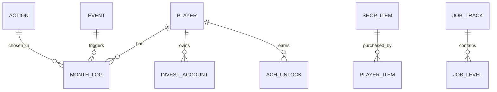

# 程序员人生模拟器 V5 研究报告

## 执行摘要

这款游戏最适合被设计成一部“长期主义的职业—财务—健康耦合模拟器”，而不是单一的“冲工资/冲存款”点击器。结合你当前 V5 的实现来看，游戏已经把起步资金设为 10 万、技术与 AI 设为 0、年龄从 22 岁起步，但它仍然把成长主线强绑定在较陡峭的薪资阶梯与“亿元俱乐部”终局上，且现有存款阶段目标仍偏财富导向，容易把玩家推向“短期加班最优”而不是“可持续职业生涯最优”。当前版本也已经有年龄阶段线、岗位等级、月度推进和基础行动/冷却机制，但整体还缺少更细的职业门槛、健康—精神的滞后损伤、城市成本差异、被动收入波动、以及更丰富的事件/商店/成就网络。fileciteturn0file0

从现实基准看，做长期生存模拟的关键，不是把数字做大，而是把“现金流、技能、年龄、精力、健康、机会窗口”之间的关系做对。中国劳动力市场在青年阶段存在明显入职摩擦；按国家统计局口径，2024 年初全国城镇不含在校生的 16—24 岁劳动力失业率在 14.6% 到 15.3%之间波动，这意味着“起步必须先学习并经历求职期”是合理设定。与此同时，国家最新就业规划已明确提出适应 AI 发展、探索“人机协作”新形态；基于中国招聘数据的研究也显示，约 28% 的职业已要求 ChatGPT 相关技能，模型预测未来还会新增约 45% 的职业提出相关要求，因此把 AI 设计为“效率乘数”和“职业转型工具”，比把它做成单独的外挂属性更接近现实。citeturn25search2turn3news0turn22academia8

报告的核心建议是：把游戏改成以“月”为单位的双循环系统。外循环是人生阶段推进：毕业求职、站稳岗位、跳槽晋升、家庭/中年压力、转管理/专家/自由职业/创业、退休与二次人生。内循环是月度决策：学习、工作、恢复、投资、副业、关系维护、健康管理、风险对冲。数值层面应采用“隐藏经验 + 软上限”的属性成长方式，存款使用“分阶段进度条 + 固定像素长度”的算法，经济系统采用“工资—税费—生活成本—被动收入—风险冲击”的闭环而不是简单加减钱。fileciteturn0file0

如果只给出最值得落地的四项结论，那么最重要的是这四条：第一，把胜利条件从“赚到某个巨额数字”改成多结局目标；第二，把健康和精神从装饰性数值改成真正的约束条件；第三，把城市层级、岗位层级、投资波动、年龄事件全部纳入月度结算；第四，把成就与商店从“奖励堆叠”改成“路线塑造器”，让玩家体验真正不同的人生策略。软件开发研究表明，开发者情绪状态与自评生产率正相关；关于软件从业者的研究也持续提示，幸福感、归属感、家庭/工作平衡与生产率密切相关，而长期高工时会显著提高中风和冠心病风险。换句话说，**“休息不是亏回合，透支才是”**，这是这类游戏应该传达的第一原则。citeturn20academia2turn20academia1turn18academia6turn20news3turn19search0

## 当前版本诊断与目标体验

你当前的 V5 已经具备几个正确方向：起始资金 10 万、技术与 AI 从 0 开始、年龄从 22 岁推进、以“月”为单位推进、岗位有等级、并设置了“生存线—安全垫—小自由—稳定自由—资本玩家—亿元俱乐部”的存款阶段，同时存在休息、学习、加班、跳槽、私活、创业等核心行动。问题不在于“有没有这些元素”，而在于它们之间的关联还不够深。比如，当前终局依然可以被“月数到顶或金钱到 10000（万元）”触发，岗位工资台阶是 1.1/1.8/3.2/5.5/8.5（万元/月），这会天然把玩家推向“更快赚钱”而不是“更稳地活下去”；同时，行动集虽然覆盖了几个典型选择，但还不足以支撑 20—40 年尺度的人生路线分化。fileciteturn0file0

因此，建议把游戏目标拆成三层。第一层是**生存目标**：不破产、不崩溃、不失能，活到退休年龄。第二层是**成长目标**：在技术、AI、声望、健康、精神、家庭/关系、资产六个维度中，至少形成两条优势曲线。第三层是**人生目标**：玩家可在“稳定专家”“技术管理者”“自由职业者”“创业者”“健康退休者”“平衡生活者”等多结局中达成其一。这样设计的好处是，玩家不再只追逐一个钱数，而是在不同价值观下形成不同的赢家定义。关于中国就业现实，青年入职难、年龄焦虑、AI 重塑岗位这三件事本来就使“单线通关叙事”失真，多结局反而更贴近现实。citeturn25search2turn17search8turn3news0turn22academia8

核心玩法循环建议改写为：**选行动 → 结算工资/副业 → 扣税费与生活成本 → 结算投资收益 → 触发事件 → 更新健康/精神 → 解锁内容与阶段目标**。注意这里“工资”和“生活成本”必须是每月自动结算，“技能提升”和“健康损耗”则应该被行动和工时共同驱动，“事件”不应当是凭空惩罚，而是玩家状态与宏观环境共同作用的结果。软件开发领域的经验研究表明，远程/在家办公对开发者生产率并非单向利好或利空，而会因项目规模、项目年龄、语言、个体差异而变化；这说明你的行动设计也不应只是“摸鱼 = 回精神”“工作 = 加钱”，而要加入项目阶段、团队关系、岗位类型、是否有明确目标等上下文因素。citeturn24academia8

重玩价值应该来自三个方面：其一，职业路线差异，比如前端、后端、数据/算法、运维、产品技术复合、独立开发者；其二，城市层级差异，一线高收入高成本高竞争，二线平衡，三线上限较低但生存压力小；其三，价值观差异，即“高风险高收益路线”与“低波动稳积累路线”都能被系统承认。AI 已经在现实劳动力市场里成为越来越常见的能力要求，但 AI 不能替代人的恢复、判断和长期成长，因此 AI 最好的游戏化方式不是“学满即无敌”，而是让它提升学习效率、文档处理、求职匹配、内容副业与个人创业成功率，却不能消除健康、精神、关系与宏观风险。citeturn22academia8turn20news6

## 现实数据基准与参数范围

为了避免数值“飘”，建议把后端货币基准统一存成**元**，前端再根据场景显示为“万元”或“元”。现实数据层面，公开、可统一访问且完全可比的“中国程序员按城市层级的中位薪酬”并不充分；因此更稳妥的做法，是用全国工资基线、城市层级经济梯度、以及 IT 岗位工资溢价来做**游戏用估算值**。国家统计局口径下，中国 2024 年城镇非私营单位月平均工资约为 10,343 元，城镇私营单位月平均工资约为 5,790 元；与此同时，一线与强二线城市的人均 GDP、住房与生活成本显著高于全国平均，且上海等核心城市住房价格与租住压力长期偏高。因此，下表更适合作为**平衡测试的参数区间**，而不是对现实市场的一比一报价。citeturn13search3turn23search4turn8academia2

| 城市层级 | 建议代表城市 | 程序员税前月薪建议区间 | 程序员税后到手建议区间 | 单人月生活成本建议区间 | 其中月租建议区间 | 备注 |
|---|---|---:|---:|---:|---:|---|
| 一线 | 北京、上海、深圳、广州 | 18,000–35,000 元 | 14,000–26,000 元 | 8,500–14,000 元 | 3,500–6,000 元 | 高竞争、高工资、高波动 |
| 二线 | 杭州、南京、成都、武汉、西安、苏州 | 12,000–24,000 元 | 9,500–18,000 元 | 5,500–9,000 元 | 2,000–3,800 元 | 平衡区，最适合长期经营 |
| 三线 | 长沙、合肥、南昌、福州、昆明等 | 8,000–16,000 元 | 6,700–12,500 元 | 4,000–6,500 元 | 1,200–2,500 元 | 生存压力低，但工资上限较低 |

注：上表均为**估算值**，应作为游戏参数基线而非现实报价；其下限参考全国城镇平均工资基线，其层级差则参考省市经济梯度与高房价/高租住成本城市的明显住房压力。用于游戏时，建议再乘以岗位等级系数、公司类型系数和市场景气系数。citeturn13search3turn23search4turn8academia2

税费建议采用“现实规则 + 游戏简化”的方式。中国综合所得个税对工资薪金适用七级累进税率，税率为 3%—45%，基本减除费用为 5,000 元/月；在此基础上，各地社保与公积金存在明显差异，所以游戏里不要做逐城逐项硬编码，而应按城市层级给出固定的“社保公积金扣除系数”，例如一线 16%–18%，二线 13%–16%，三线 11%–14%，作为求解税后到手的简化参数。这样既保留现实感，又避免后端复杂度失控。citeturn13search0turn14search4

推荐的工资公式如下，适合直接写进后端：

```pseudo
# 所有金额以“元”为底层单位存储
gross_salary = base_salary[city_tier][job_level] 
             * track_coef[career_track]
             * company_coef[company_type]
             * market_coef[market_state]

social_fund = gross_salary * social_rate[city_tier]   # 游戏化简化
annual_taxable = gross_salary * 12 - social_fund * 12 - 60000 - annual_special_deduction
annual_iit = IIT(annual_taxable)                      # 按 3%~45% 累进税率
monthly_net = gross_salary - social_fund - annual_iit / 12
```

这里 `company_type` 可取外企/大厂/普通民企/创业公司，`market_state` 可取冷/中/热三档，`annual_special_deduction` 可以默认给一个低配值或作为生活选择项解锁。这样做的好处是：同一个岗位等级，在一线和三线城市不会只是“工资不一样”，而是“净储蓄率、跳槽价值和风险承受力”都不一样。citeturn13search0turn14search4

## 成长、经济与存款进度模型

属性建议全部采用“**隐藏经验 + 显示属性**”结构，而不要直接让属性线性上涨。最稳妥的写法是：技术、AI、声望拥有各自的 XP，显示时再映射到 0—100。这样前期成长快、后期边际递减明显，而且便于你在不同动作之间分配收益。建议采用指数贴近式软上限：

```pseudo
tech = floor(100 * (1 - exp(-tech_xp / 240)))
ai   = floor(100 * (1 - exp(-ai_xp   / 180)))
rep  = floor(100 * (1 - exp(-rep_xp  / 260)))
```

如果你更希望手感“可控”，也可以直接对每个行动的增益乘上软上限系数：

```pseudo
gain(stat, base) = base * max(0.15, (1 - stat / softcap)^decay)
# softcap 可取 85~90，decay 可取 1.2~1.8
```

这类设计与现实职业成长更一致：新手阶段每一点学习都带来巨大感知收益，进入中高级后，继续提升的成本会迅速上升，而 AI 技能通常又会比传统技术栈更“快学快用”。中国招聘数据研究已表明 AI 相关技能要求正在扩张，所以 AI 曲线可以略快于通用技术曲线，但上限不应独立决定职业层级。citeturn22academia8turn16academia3

岗位成长建议不要只看技术阈值，而应采用“技能 + 时间 +表现 +健康门槛”的联合判定。软件开发者生产率与情绪/幸福感相关，且心理健康问题已被证明是软件行业的重要议题，因此晋升与跳槽不应仅靠刷数值，也应受精神和健康状态约束。推荐的岗位解锁条件如下：实习/新人需要 `tech >= 12` 且完成一次项目实战；初级工程师需要 `tech >= 28 && ai >= 8 && rep >= 3`；中级需要 `tech >= 50 && ai >= 20 && rolling_perf_6m >= 60 && health >= 45`；高级需要 `tech >= 72 && ai >= 35 && rep >= 18 && mental >= 40`；专家/负责人则要求 `tech >= 85 && ai >= 50 && rep >= 35`，并在过去 24 个月内至少完成一次分享、一次 mentoring 或一次跨团队项目。citeturn20academia2turn20academia4turn18academia6

绩效建议采用滚动平均，而不是月月跳。示例：

```pseudo
mental_eff = clamp(0.55 + mental / 100 * 0.45, 0.55, 1.0)
health_eff = clamp(0.60 + health / 100 * 0.40, 0.60, 1.0)

monthly_perf = (0.45 * tech + 0.25 * ai + 0.15 * rep + 0.15 * task_fit) 
             * mental_eff * health_eff

rolling_perf_6m = avg(last_6_month_perf)
```

`task_fit` 用来体现岗位/行动契合度，例如前端做 AI 自动化文档、全栈做独立产品、后端做高并发项目都应得到不同加成。这样可以避免“只要 tech 高，任何路线都通杀”的问题。citeturn24academia8turn20academia0turn20academia2

存款系统建议从“求最终值”改成“求阶段穿越”。你当前版本已经有阶段化思路，但早期跨度仍然偏大，而且条形进度应固定宽度，不应随文本或目标数增长而挤压卡片。建议采用下面这套更适合长期人生模拟的阶段目标：

| 阶段 | 目标存款 | 阶段意义 | 建议解锁 |
|---|---:|---|---|
| 起步线 | 100,000 元 | 已有启动资金，不至于立刻破产 | 基础学习、求职 |
| 紧急备用金 | 150,000 元 | 约 3 个月低配缓冲 | 基础投资、保险 |
| 半年缓冲 | 300,000 元 | 可以扛一次失业/生病/搬家 | 跳槽、租房升级 |
| 职业转型金 | 500,000 元 | 可支撑转岗或深度学习 | 长课程、证书、副业尝试 |
| 家庭与风险基金 | 1,000,000 元 | 抗大事件能力显著提升 | 家庭事件、长期规划 |
| 财务喘息区 | 3,000,000 元 | 被动收入开始有现实意义 | 指数投资、内容副业 |
| 准财务自由 | 6,000,000 元 | 可以明显降低工作强度 | 自由职业、创业二次试错 |
| 长期自由 | 10,000,000 元 | 不是通关，而是高安全区 | 退休/再学习/第二人生 |

注：这组目标比“早早冲亿元”更适合月度长期经营；它把前 10–15 年的关键里程碑拉近，能让玩家更频繁地获得“阶段胜利”反馈。你当前文件中的“生存线—安全垫—小自由—稳定自由—资本玩家—亿元俱乐部”方向是对的，但建议把重点放在前半段，并把“1,000 万”从硬终局改为高安全区。fileciteturn0file0

固定长度进度条建议这样算：

```pseudo
targets = [100000,150000,300000,500000,1000000,3000000,6000000,10000000]

stage_index = max i such that cash >= targets[i]
prev = targets[stage_index]
next = targets[min(stage_index + 1, len(targets)-1)]

# 页面长度固定为 8 段，每段固定像素宽度
segment_progress = clamp((cash - prev) / (next - prev), 0, 1)
total_progress = (stage_index + segment_progress) / (len(targets) - 1)
```

示例：玩家现金为 420,000 元，位于 300,000 到 500,000 区间，则 `segment_progress = 0.60`，整条进度条只填充到第 3 段的 60%，页面高度不会变化，手机端也不会因为数字位数增长而“把卡片顶高”。这是比“按终局金额线性缩放”更适合前端定长卡片的算法。fileciteturn0file0

被动收入不应只是一条不断上涨的直线，应该有分类型收益与风险。股票类可参考沪深 300 的长期历史波动：2005—2024 年度回报既有极高正收益，也有深度回撤，几何平均回报显著低于算术平均回报，说明做游戏时应保留“长期正期望 + 短期大波动”的特征，但对极端值做压缩以保证可玩性。citeturn21search1

建议的被动收入模型如下：

| 类型 | 年化收益中枢 | 波动 | 月度模型建议 | 解锁条件 |
|---|---:|---:|---|---|
| 现金管理 | 1.5%–2.5% | 极低 | 固定收益或极窄随机区间 | 紧急备用金 |
| 债券/稳健 | 2.5%–4.5% | 低 | 正态分布，截断在 -1%~+1%/月 | 半年缓冲 |
| 指数基金 | 6%–8% | 高 | 对数正态/截断正态，允许年度回撤 | 1,000,000 元 |
| 内容副业版权 | 0%–20%+ | 中高 | 先投入，后随声望与作品衰减 | 声望 20+ |
| 小生意/工具产品 | -100%–50%+ | 极高 | 伯努利成功 + 长尾收益 | 技术/AI/声望同时达标 |

注：除现金管理外，不建议任何资产写成“稳稳赚钱”。股票类建议做“期望正，但短期负收益频繁出现”；内容类被动收入建议带衰减和平台规则风险；创业/工具产品应明确允许归零。沪深 300 历史年回报波动极大，因此游戏应保留波动性，但可对极端年份做截断压缩。citeturn21search1

## 行动、事件、商店与成就设计

行动系统建议扩充为“至少 16 项长期可玩动作”，并用“月耗 + 收益 + 副作用 + 解锁条件”描述。以下表格可直接转为后端配置表。为了统一单位，下面把金钱都写成“元/月”或“万元/月”的人类可读写法；后端应转换为整数元存储。

| 行动 | 月耗 | 直接收益 | 副作用 | 解锁条件 |
|---|---:|---|---|---|
| 系统学习 | 1 月 | 技术 XP +18 | 精神 -4，现金 -2,000 | 初始可用 |
| 算法训练 | 1 月 | 技术 XP +14，求职成功率 +3% | 精神 -5 | 初始可用 |
| 项目实战 | 1 月 | 技术 XP +12，作品集 +1 | 现金 -3,000，精神 -3 | 初始可用 |
| AI 工具训练 | 1 月 | AI XP +18，后续学习效率 +5% | 精神 -4 | 初始可用 |
| 英语/表达训练 | 1 月 | 声望 XP +6，跳槽率 +2% | 现金 -1,500 | 初始可用 |
| 求职投递 | 1 月 | 获得 offer 检定次数 +1 | 精神 -6，失败累积挫败 | 技术 ≥ 12 且作品集 ≥ 1 |
| 认真上班 | 1 月 | 正常工资，技能 XP +6 | 精神 -5，健康 -2 | 获得工作 |
| 加班冲刺 | 1 月 | 工资奖金 +20%~35%，技能 XP +10 | 精神 -14，健康 -8，燃尽值上升 | 获得工作 |
| 开源贡献 | 1 月 | 技术 XP +8，声望 XP +10 | 现金 0~+500，精神 -6 | 技术 ≥ 25 |
| 技术分享/写作 | 1 月 | 声望 XP +12，求职/副业加成 | 精神 -5 | 声望 ≥ 8 |
| 人脉经营 | 1 月 | 推荐机会、轻事件正面权重上升 | 现金 -1,000，精神 +2/-2 | 声望 ≥ 5 |
| 面试跳槽 | 2 月 | 成功则岗位跃迁、签字费 | 精神 -10，2 个月机会成本 | 技术 ≥ 28，冷却 6 月 |
| 内部晋升准备 | 2 月 | 晋升概率 +15% | 精神 -8，健康 -3 | 在职 6 月以上 |
| 接私活 | 1 月 | 现金 +3,000~20,000 | 精神 -12，健康 -4，连续做递减 | 技术 ≥ 40 |
| 自媒体/课程制作 | 2 月 | 声望 +15，后续被动收入种子 | 现金 -5,000，短期收益低 | 技术 ≥ 45 或 AI ≥ 35 |
| 健身训练 | 1 月 | 健康 +8，精神 +3 | 现金 -1,500，时间占用 | 初始可用 |
| 体检/治疗 | 1 月 | 健康 +12，重大疾病概率下降 | 现金 -2,000~8,000 | 初始可用 |
| 旅行休整 | 1 月 | 精神 +15，关系 +4 | 现金 -5,000~15,000，技术 0 | 现金充足 |
| 休息摸鱼 | 1 月 | 精神 +10，健康 +4 | 技术 XP -2，声望 -1，生活费照扣 | 初始可用 |
| 投资复盘 | 1 月 | 投资误判率下降，风险认知上升 | 收益不立即显现 | 30 万元以上 |
| 创业试错 | 3 月 | 成功则现金流跃迁 | 失败可亏损本金并伤精神/健康 | 技术 ≥ 75，AI ≥ 45，资金 ≥ 50 万 |

注：这里故意把“认真上班”“开源”“分享”“人脉”“投资复盘”“体检/治疗”纳入行动，是因为现实中的开发者并不是把所有时间都花在写代码上；来自百度团队的研究显示，开发者生产率会因远程状态、项目规模、项目年龄而显著变化，而现实行业观察也指出，很多开发者的损耗来自沟通、信息检索、团队低效与非编码工作。行动池如果只有“学/班/卷/歇”，就无法模拟真实职业生态。citeturn24academia8turn20news6

随机事件建议拆成**轻事件池**与**大事件池**。轻事件每月至多 1 次，大事件每 6—12 个月期望触发 1 次。推荐采用“状态驱动危害率”：

```pseudo
stress = max(0, 55 - mental) + max(0, 50 - health) + overtime_streak * 4
reserve_shield = clamp(cash / 300000, 0, 1.2)
career_risk = risk_coef[career_track] + market_risk[market_state]

p_light = clamp(0.22 + stress * 0.003 + career_risk * 0.04 - reserve_shield * 0.03, 0.10, 0.45)
p_major = clamp(0.03 + stress * 0.0015 + age_factor + career_risk * 0.02 - insurance_shield, 0.01, 0.12)
```

这让事件不再是“天降惩罚”，而是玩家自己的连续选择逐渐累积出来的风险。长期高工时确实会带来更高健康损害风险；WHO/ILO 相关研究表明，长期每周 55 小时及以上工时与更高的中风、冠心病风险相关，因此“加班 streak 越长，健康回撤和负面事件概率越高”是有现实依据的。citeturn20news3turn19search0

建议的关键事件表如下：

| 事件 | 类型 | 建议频率 | 主要效果 | 触发偏向 |
|---|---|---:|---|---|
| 朋友内推 | 轻事件 | 月度低频 | 跳槽成功率 +10% | 声望高、人脉高 |
| AI 工具突破 | 轻事件 | 月度低频 | 接下来 3 月 AI 学习效率 +20% | AI 学习中 |
| 房租上涨 | 轻事件 | 月度中频 | 月生活成本 +300~800 元 | 一线/二线租房 |
| bug 事故背锅 | 轻事件 | 月度低频 | 精神 -6，声望 -2 | 低精神、连续加班 |
| 导师出现 | 轻事件 | 月度低频 | 技术 XP 立即 +10，跳槽 CD -1 月 | 学习/开源活跃 |
| 小病一场 | 轻事件 | 月度中频 | 健康 -8，现金 -500~2,000 元 | 低健康 |
| 裁员风波 | 大事件 | 半年低频 | 失业或工资下调 10%~20% | 市场冷、高风险公司 |
| 家庭医疗支出 | 大事件 | 半年低频 | 现金 -5,000~50,000 元 | 年龄增长、无保险 |
| 爆款副业机会 | 大事件 | 半年低频 | 被动收入种子 +，声望 + | 有内容积累 |
| 大厂 offer | 大事件 | 半年低频 | 岗位跃迁，工资大涨，精神压力上升 | 高技术、高声望 |
| 创业合伙分歧 | 大事件 | 低频 | 现金损失、精神大降 | 创业路线 |
| 牛市/反弹窗口 | 大事件 | 低频 | 指数账户阶段收益显著上升 | 持有权益资产 |

注：建议让轻事件的正负面权重在“简单/标准/困难”三种难度中不同，但所有难度都保留正负两类事件，避免把“困难”做成纯惩罚模式。中国最新就业规划强调 AI 与就业协同适配，而现实市场也确有景气与冷却并存，因此事件池应该含有“结构性机会”而不只是“结构性打击”。citeturn3news0turn25search2

商店系统不应是“数值药水店”，而应是“生活方式与生产资料商店”。推荐分为设备、学习、健康、风险管理、居住、关系与订阅七类：

| 类别 | 商品 | 价格 | 效果 | 类型 |
|---|---|---:|---|---|
| 设备 | 双显示器 | 1,500 元 | 认真上班/项目实战效率 +4% | 一次性 |
| 设备 | 降噪耳机 | 1,200 元 | 精神损耗 -1/月 | 被动 |
| 设备 | 人体工学椅 | 2,000 元 | 健康损耗 -1/月 | 被动 |
| 学习 | 系统课套餐 | 3,000 元 | 技术学习收益 +10%，持续 6 月 | 时效型 |
| 学习 | AI Pro 订阅 | 200 元/月 | AI 行动收益 +20%，文档动作收益 +10% | 订阅 |
| 健康 | 健身房年卡 | 2,500 元 | 健身训练额外健康 +3 | 时效型 |
| 健康 | 心理咨询包 | 2,400 元 | 使用时精神 +18，燃尽值 -10 | 消耗品 |
| 风险管理 | 商业医疗险 | 800 元/年 | 医疗类大事件损失 -40% | 订阅 |
| 风险管理 | 紧急备用金账户 | 0 元 | 现金锁定后重大事件伤害减免 | 被动机制 |
| 居住 | 合租升级单间 | 押金 5,000 元，月租 +800 元 | 精神 +4/月，现金流下降 | 状态型 |
| 居住 | 通勤优化搬家 | 一次性 3,000 元 | 每月通勤成本 -300 元，健康 +1/月 | 一次性 |
| 关系 | 节日社交预算 | 800 元 | 人脉正事件权重提升 | 消耗品 |
| 关系 | 家庭支持基金 | 10,000 元 | 家庭负面事件强度下降 | 被动 |

注：商品效果尽量是“减少摩擦”“改变路线”而不是“直接送钱”。从现实软件工作研究看，影响幸福感与生产率的往往是环境、归属、安全感、恢复与协作，而不是单点暴击式加成，因此商店最健康的设计是“慢变量增强器”。citeturn20academia0turn18academia6turn24academia8

成就系统建议分成“里程碑成就”“长期主义成就”“逆风成就”“价值观成就”。奖励以称号、少量一次性资源、解锁内容为主，避免直接送钱过多。示例如下：

| 成就 | 条件 | 奖励 | 设计意图 |
|---|---|---|---|
| 第一份 Offer | 首次找到工作 | 声望 +2 | 让起步期有明确目标 |
| 三个月缓冲 | 存款达到 15 万元 | 解锁保险 | 强化备用金观念 |
| 半年不断学 | 连续 6 个月含学习动作 | 技术 XP 奖励 | 奖励长期学习 |
| 开源初亮相 | 首次完成开源贡献 | 声望 +3 | 允许非上班成长 |
| 熬过 35 | 年龄达到 35，且未破产 | 精神 +6 | 将年龄焦虑转化为韧性成就 |
| 不卷也能活 | 连续 12 个月未使用加班冲刺且未降薪 | 健康 +5 | 奖励平衡路线 |
| 燃尽归来 | 精神低于 20 后恢复到 60 | 解锁心理咨询折扣 | 把恢复做成正向剧情 |
| 第一桶金 | 存款达到 100 万元 | 投资功能增强 | 连接资产系统 |
| 副业有声 | 被动收入首次超过月薪 20% | 声望 +5 | 鼓励第二增长曲线 |
| 家庭守护者 | 处理一次家庭大事件且未破产 | 家庭事件强度下降 | 体现责任与韧性 |
| 可持续大师 | 退休时健康 ≥ 70、精神 ≥ 70 | 特殊结局 | 明确价值观 |
| 第二人生 | 退休后成功转内容/教学/开源路线 | 隐藏结局 | 拓展后期玩法 |

防刷建议有三条。第一，成就奖励绝大多数只触发一次，不给可循环刷钱。第二，对连续重复动作引入边际递减，例如连续三个月“休息摸鱼”后恢复收益下降，连续三个月接私活后精神损耗增加。第三，把大奖励放在“跨维度条件”上，例如必须同时满足现金、健康、精神和声望，避免玩家用单维度极限刷法拿完所有成就。软件开发幸福感与生产率的关系说明，单一维度极致并不代表真实成功，因此成就系统也应体现“平衡比极端更难也更有价值”。citeturn20academia2turn20academia0

## 心理健康、随机公平与价值观

心理与健康系统是这款游戏的“物理引擎”。如果这部分不严谨，前面的工资、技能和存款全都会变成表面文章。世界卫生组织在 ICD-11 中把职业倦怠定义为一种由未被成功管理的长期工作压力导致的职业相关现象，其典型表现包括精力耗竭、对工作的心理距离增加、玩世不恭/消极感，以及职业效能下降；软件开发领域的研究也多次发现，开发者情绪状态、幸福感、心理健康与生产率显著相关。换句话说，精神值不应只是“蓝条”，而应直接影响学习效率、工作表现、事件风险与恢复需求。citeturn19search0turn20academia2turn20academia4

建议把“精神”“健康”“燃尽负荷”拆开。精神代表短期恢复与情绪状态，健康代表中长期身体承载力，燃尽负荷是一个隐藏变量，记录过去 3—6 个月的累计透支。推荐规则如下：精神低于 40，学习和工作效率分别下降 10% 和 8%；低于 25，负面事件概率上升 25%，跳槽/晋升成功率下降 10%；低于 15，触发“强制恢复提醒”；健康低于 35，所有高压行动额外追加损伤；健康低于 20，只允许执行低强度行动；任一归零直接失败。长期工时研究表明，55 小时及以上工时与更高的心脑血管风险相关，因此“加班冲刺”或“创业试错”如果连续触发，应快速抬升燃尽负荷，而不是只扣一点即刻数值。citeturn20news3turn19search0

可直接使用下面的量化模型：

```pseudo
# 月末结算
burnout_load += overtime_months * 6 + max(0, 45 - mental) * 0.3 + max(0, 40 - health) * 0.4
burnout_load -= rest_quality * 5 + therapy_sessions * 8 + vacation_bonus * 10
burnout_load = clamp(burnout_load, 0, 100)

mental_delta = action_mental_gain - life_pressure - max(0, burnout_load - 40) * 0.15
health_delta = action_health_gain - chronic_overwork_penalty - sedentary_penalty + exercise_bonus

if burnout_load >= 70:
    add_modifier("burnout", perf=-0.18, event_risk=+0.20)
if mental <= 15 or health <= 20:
    force_rest_next_month = true
```

这套系统的好处在于：玩家可以偶尔爆肝，但无法长期无成本地爆肝。恢复行为的价值也被结构化了：普通摸鱼只能回短期精神，旅行/假期/治疗/持续运动才能真正清除燃尽负荷。关于软件开发者群体，研究显示，归属感和支持感与较低的 burnout 水平相关，开发者幸福感也是生产率的重要影响因素，所以游戏中“人脉经营”“导师”“家庭支持”“心理咨询”这些非技术动作应具有真实的护城河价值。citeturn18academia6turn20academia0turn20academia2

随机性与公平性的平衡，建议遵循三条原则。第一，**所有坏运气都应该有可解释来源**：现金储备少、无保险、连续加班、市场转冷、年龄阶段变化，都应能提升特定事件权重。第二，**所有重大坏事件都应该有对冲手段**：保险、备用金、关系、技能迁移、AI 工具熟练度、城市迁移都可以降低伤害。第三，**随机数要可重现**：同一局存档必须可以用统一种子复盘。推荐用 `mulberry32` 或 `xoshiro` 作为前后端一致的 PRNG，并把 `seed ^ month ^ action_hash ^ player_id` 作为每月事件子种子。这样做能够支持录像回放、平衡测试、玩家申诉与 A/B 分析。citeturn21search1turn24academia8

世界观与价值观建议写成下面这段，直接可以放进游戏开场文案：

> 这不是一款赞美透支与暴富神话的游戏。  
> 你扮演的不是一台永远卷得动的生产机器，而是一个会成长、会疲惫、会迷茫、会恢复的人。  
> 技术可以改变命运，AI 可以放大能力，投资可以提升自由度，但真正决定人生质量的，是你是否能在不确定的世界里持续学习、理性选择、照顾身体、守住心理边界，并把时间用在真正重要的事情上。  
> 在这里，成长优先于赌运气，可持续优先于短期爆发，健康不是装饰条，财富不是唯一胜利，人生从来不只有一条标准答案。

这段价值观之所以成立，是因为现实世界里，AI 确实正在重塑岗位要求，但“人机协作”而非“纯替代”才是更稳健的方向；而软件开发和知识工作也持续显示，单纯延长工时并不能稳定带来高质量产出，反而常常伴随更高的健康与心理代价。把这些原则写入机制，本身就在增强游戏的教育性与可信度。citeturn3news0turn22academia8turn20news3turn20academia2

## 测试、调参与开发优先级

可量化测试必须围绕“是否形成了真实人生曲线”来做，而不是只看“钱涨得快不快”。建议至少监控这组核心指标：首次拿到工作 Offer 的月数中位数；24 个月、60 个月、120 个月的存款中位数与分位数；不同难度下的燃尽率、失业率、破产率；各职业路线的退休存活率；平均通关月数；“可持续大师”结局解锁率；连续 3 个月以上加班冲刺的玩家占比；商店商品渗透率；成就解锁率；重大负事件后一年内恢复概率。青年就业摩擦、年龄焦虑和 AI 转型都是真实存在的，因此一款“长期生存模拟器”的平衡标准，不该是让人人都轻松发财，而是让大多数认真经营的玩家能活下来、部分玩家实现上升、少数高风险玩家收获大起大落。citeturn25search2turn17search8turn22academia8

建议的目标区间可以这样设：标准难度下，玩家从 22 岁开始，首次找到工作的中位月数控制在 4—8 个月；第 24 个月存款中位数应高于起始资金但不应普遍超过 30 万元；第 120 个月达到 100 万元存款的比例建议在 35%—55%；明显燃尽的比例建议在 15%—25%；退休存活率建议在 45%—70%。这些不是现实统计，而是游戏平衡目标，用于确保“认真学、认真做、合理休息”的玩家能看到希望，但“纯摸鱼”或“纯透支”都不会成为统治性策略。citeturn20news3turn20academia2turn20academia4

A/B 测试建议从三组参数开始。第一组测“恢复是否足够有价值”：对比休息/月假/心理咨询/健身对精神与燃尽负荷的削减幅度。第二组测“工资曲线是否过陡”：对比岗位等级工资系数与生活成本系数，观察早期是否过于贫困、后期是否过快暴富。第三组测“事件是否过分依赖脸黑”：对比大事件基准概率、保险减伤幅度和备用金护盾效果。所有测试都应记录同一随机种子下的复现结果。citeturn21search1turn20news3

建议你在开发文档中加入以下图表与 mermaid 图，而不是只靠文字调参。最实用的图表有：城市层级薪酬区间箱线图、各路线 10 年存款分位折线图、技术/AI/精神/健康成长曲线、燃尽负荷热力图、重大事件对现金流的冲击瀑布图、成就解锁漏斗图。Mermaid 建议至少画两张：一张月度结算流程图，一张实体关系图。示例如下：




主要参考来源建议在设计文档中保留为“源名 + 可点击引用”的形式，便于你后续继续扩展参数库：

- 国家统计相关年度数据与统计口径（经公开可见二次汇编页面转引）citeturn13search3turn23search4turn25search2  
- 中国最新就业政策与 AI 人机协作导向citeturn3news0  
- 基于中国招聘平台数据的 AI 技能需求研究citeturn22academia8turn16academia3  
- 软件开发者幸福感、情绪与生产率研究citeturn20academia0turn20academia2turn20academia1  
- 软件从业者心理健康与工作情境研究citeturn20academia4turn24academia8turn18academia7  
- WHO/ILO 相关职业倦怠与长工时健康风险依据citeturn19search0turn20news3  
- 中国年龄焦虑与“35 岁门槛”公共讨论脉络citeturn17search8  
- 沪深 300 历史年度回报与中国权益资产高波动性参照citeturn21search1  
- 上海高房价/高租住压力及大城市住房成本研究参照citeturn23search3turn8academia2  
- 当前 V5 文件的现状与约束fileciteturn0file0  

开发优先级建议按下面顺序推进：

- 先重构后端数值底座：统一货币单位、改成“工资—成本—投资—事件—状态”的月度闭环。
- 再重做属性系统：引入隐藏 XP、软上限、燃尽负荷、滚动绩效，不要再让单月操作决定长期命运。
- 接着扩充行动/事件/商店/成就配置表，把玩法从 6—8 个动作扩成完整的人生策略池。
- 然后改存款进度与胜利条件：从“冲巨额终局”改为“分阶段目标 + 多结局”。
- 最后做可观测性：加入随机种子、调参面板、平衡指标面板与图表导出。